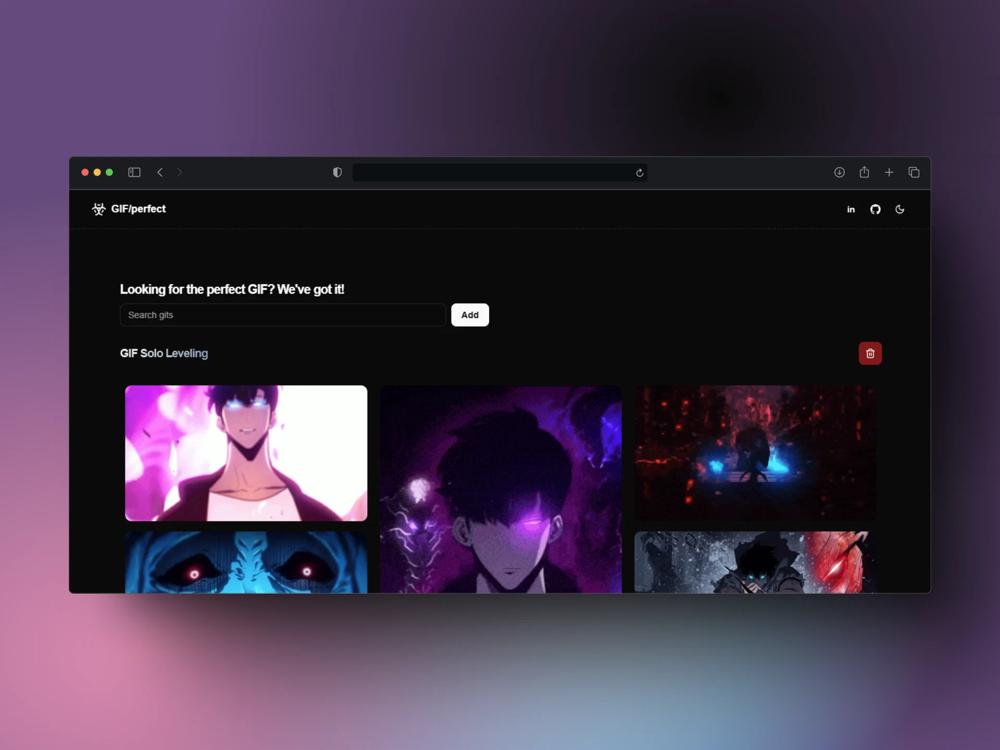

# GIF Perfect App 🎭



Una aplicación de búsqueda de GIFs desarrollada con **React + Vite**, que consume la API de Giphy para mostrar resultados en tiempo real.

## 🚀 Tecnologías Utilizadas

- [Vite](https://vitejs.dev/) ⚡ - Entorno de desarrollo rápido para React.
- [React](https://react.dev/) ⚛️ - Biblioteca para construir interfaces de usuario.
- [TailwindCSS](https://tailwindcss.com/) 🎨 - Estilos modernos y responsivos.
- [Giphy API](https://developers.giphy.com/) 🖼️ - Para obtener los GIFs.
- [shadcn/ui](https://ui.shadcn.com/) ⚪ - Conjunto de componentes accesibles

## 📌 Características

✅ Búsqueda de GIFs en tiempo real.<br>
✅ Interfaz responsiva y moderna con TailwindCSS.<br>
✅ Manejo eficiente del estado con `useState` y `useEffect`.<br>
✅ Consumo de API con `fetch`.<br>

---

## 📦 Instalación y Uso

### 1️⃣ Clona el repositorio

```sh
 git clone https://github.com/JS-VILLARREAL/perfect-gif.git
 cd perfect-gif
```

### 2️⃣ Instala las dependencias

```sh
 npm install
```

### 3️⃣ Configura tu clave de API

Crea un archivo `.env` en la raíz del proyecto y agrega tu clave de Giphy API:

```sh
VITE_GIPHY_API_KEY=tu_api_key_aqui
```

### 4️⃣ Inicia el servidor de desarrollo

```sh
 npm run dev
```

---

## 📌 Mejoras Futuras

- 🔍 Agregar filtros avanzados de búsqueda.
- 🎨 Mejorar la UI/UX.
- 📌 Guardar GIFs favoritos en `localStorage`.

---

## 🛠️ Contribución

¡Las contribuciones son bienvenidas! Si deseas mejorar este proyecto, sigue estos pasos:

1. Haz un fork del repositorio.
2. Crea una nueva rama: `git checkout -b feature-nueva`.
3. Realiza tus cambios y haz un commit: `git commit -m 'Agrega nueva funcionalidad'`.
4. Sube los cambios: `git push origin feature-nueva`.
5. Abre un Pull Request.

---

## 📝 Licencia

Este proyecto está bajo la licencia **MIT**.

---

📌 **Desarrollado por [Steven Villarreal](https://github.com/JS-VILLARREAL) 🚀**
